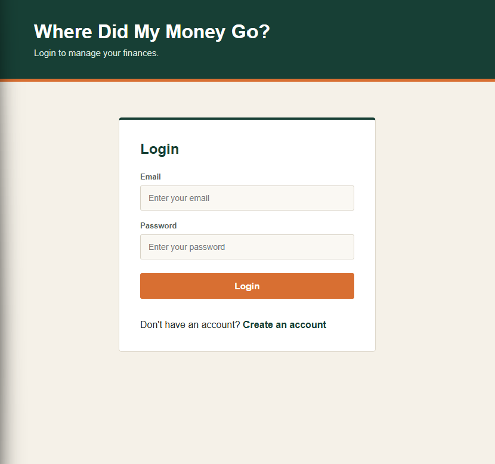
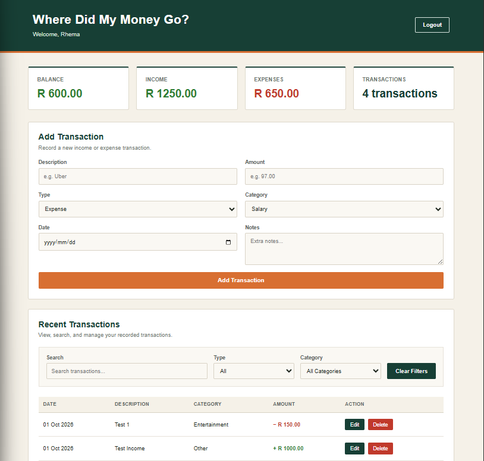
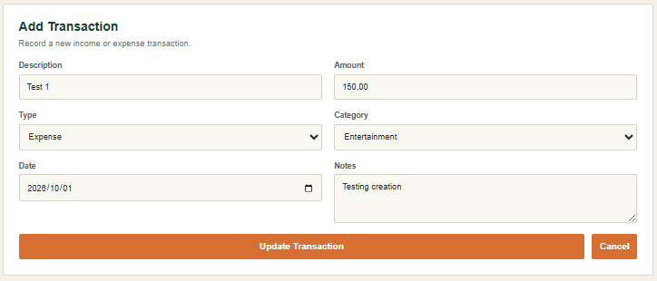

# Where Did My Money Go?

**Where Did My Money Go?** is a full-stack personal finance tracker built with **Python, Flask, MySQL, HTML, CSS, and JavaScript**.

This project was created as a practical learning project to understand how a real-world full-stack application is planned, developed, tested, and maintained. Development progressed incrementally from database design and REST API development to authentication, frontend integration, analytics, user experience, testing, and version control with Git and GitHub.

The main goal of the project is not simply to build a finance tracker, but to understand how the different components of a full-stack application work together.

---

## Project Goal

The purpose of this project is to gain hands-on experience building and maintaining a complete web application.

Throughout the project, I worked with:

* Relational database design
* REST API development with Flask
* Python and MySQL integration
* CRUD functionality
* JWT-based authentication
* Password hashing
* User-specific data access
* Frontend development with HTML, CSS, and JavaScript
* REST API integration using the Fetch API
* Dynamic dashboards and financial analytics
* Loading, error, and empty states
* API testing with Postman
* Git and GitHub version control
* Modular frontend and backend structure

The emphasis is on understanding the development process rather than only producing the final application.

---

## Current Version

### Full-Stack Application

The project consists of a Flask backend, MySQL database, and connected frontend.

Users can register and log in, manage their financial transactions, filter their transaction history, and view financial information through a dashboard.

JWT authentication protects the API, while database queries restrict transaction access to the authenticated user.

The application is currently intended as a **local development and portfolio project**. It is not deployed as a public web application.

---

## Screenshots

### Login



### Dashboard and Analytics



### Edit Transaction



---

## Features

### Authentication

* User registration
* User login
* Password hashing
* JWT authentication
* Protected API routes
* Client-side session handling
* Logout functionality
* Automatic handling of expired sessions

### Transaction Management

* Create income and expense transactions
* Edit existing transactions
* Delete transactions
* View transaction history
* Categorize transactions
* Add optional notes
* Select transaction dates
* Input validation
* User-specific transaction access

### Transaction Filtering

* Search transactions by title
* Filter by transaction type
* Filter by category
* Clear filters
* Dynamic transaction count based on filtered results

### Dashboard and Analytics

* Current balance
* Total income
* Total expenses
* Transaction count
* Spending by category
* Daily spending trend
* Dynamic summary calculations
* Analytics based on the active filters
* Positive, negative, and neutral balance states

### User Experience

* Responsive dashboard
* Loading states
* Empty states
* Error states
* Success and error notifications
* Custom delete confirmation modal
* Edit and cancel-edit functionality
* Form validation
* Income and expense visual distinction
* Responsive layout for different screen sizes

---

## Tech Stack

| Technology         | Purpose                         |
| ------------------ | ------------------------------- |
| Python             | Backend programming language    |
| Flask              | Web framework and REST API      |
| MySQL              | Relational database             |
| mysql.connector    | MySQL database connectivity     |
| HTML5              | Frontend structure              |
| CSS3               | Styling and responsive design   |
| JavaScript (ES6)   | Frontend functionality          |
| Flask-JWT-Extended | JWT authentication              |
| Werkzeug           | Password hashing                |
| python-dotenv      | Environment variable management |
| Postman            | API testing                     |
| Git                | Version control                 |
| GitHub             | Repository hosting              |

---

## Project Structure

```text
Where-did-my-money-go/
│
├── backend/
│   ├── routes/
│   │   ├── auth.py
│   │   ├── transactions.py
│   │   └── analytics.py
│   │
│   ├── app.py
│   └── database.py
│
├── frontend/
│   ├── index.html
│   ├── register.html
│   ├── dashboard.html
│   │
│   ├── css/
│   │   └── style.css
│   │
│   └── js/
│       ├── app.js
│       ├── auth.js
│       ├── login.js
│       ├── register.js
│       ├── analytics.js
│       ├── transactions.js
│       ├── filters.js
│       ├── modal.js
│       └── notifications.js
│
├── postman/
│   ├── collections/
│   └── globals/
│
├── .gitignore
├── .gitattributes
├── requirements.txt
└── README.md
```

### Backend

The backend is responsible for authentication, database communication, transaction management, and analytics.

* **app.py** — Flask application entry point, JWT configuration, CORS, route registration, and frontend page routes
* **database.py** — MySQL connection management
* **auth.py** — User registration and login
* **transactions.py** — Transaction CRUD endpoints
* **analytics.py** — Financial analytics endpoints

### Frontend

The frontend communicates with the Flask API using JavaScript's Fetch API.

* **index.html** — Login page
* **register.html** — Registration page
* **dashboard.html** — Main application dashboard
* **style.css** — Application styling and responsive design
* **app.js** — Application initialization and event listeners
* **auth.js** — Authentication, session handling, and logout
* **login.js** — Login functionality
* **register.js** — Registration functionality
* **transactions.js** — Transaction loading, creation, editing, deletion, and display
* **filters.js** — Transaction search and filtering
* **analytics.js** — Dashboard calculations and financial analytics
* **modal.js** — Delete confirmation modal
* **notifications.js** — Frontend notification system

### Postman

The repository includes Postman workspace and collection files used during API development and testing.

---

## Database Design

The application uses a relational MySQL database called `track_money`.

The database contains three primary tables:

```text
user
 │
 │ 1
 │
 │ Many
 ▼
transaction
 ▲
 │ Many
 │
 │ 1
category
```

### Tables

**user**

Stores registered application users.

**category**

Stores transaction categories.

**transaction**

Stores income and expense transactions and connects them to users and categories.

### Relationships

* One user can have many transactions.
* One category can contain many transactions.
* Every transaction belongs to one user.
* Every transaction belongs to one category.

JWT authentication identifies the authenticated user, while database queries restrict transaction access to that user.

---

## REST API

### Authentication

| Method | Endpoint         | Description                           |
| ------ | ---------------- | ------------------------------------- |
| POST   | `/auth/register` | Register a new user                   |
| POST   | `/auth/login`    | Authenticate a user and receive a JWT |

### Transactions

| Method | Endpoint             | Description                                    |
| ------ | -------------------- | ---------------------------------------------- |
| GET    | `/transactions`      | Retrieve the authenticated user's transactions |
| GET    | `/transactions/<id>` | Retrieve a specific transaction                |
| POST   | `/transactions`      | Create a transaction                           |
| PUT    | `/transactions/<id>` | Update a transaction                           |
| DELETE | `/transactions/<id>` | Delete a transaction                           |

### Analytics

| Method | Endpoint                | Description                           |
| ------ | ----------------------- | ------------------------------------- |
| GET    | `/analytics/summary`    | Retrieve financial summary data       |
| GET    | `/analytics/categories` | Retrieve spending grouped by category |
| GET    | `/analytics/trend`      | Retrieve daily spending totals        |

Transaction and analytics endpoints require a valid JWT access token.

---

## API Testing

The backend was tested independently using Postman before and during frontend integration.

Testing covered:

* User registration
* Duplicate registration
* User login
* Invalid login attempts
* JWT authentication
* Protected routes
* Missing authentication tokens
* Transaction CRUD operations
* User transaction isolation
* Analytics endpoints
* Input validation
* Error handling
* Expired authentication tokens

Testing the backend independently helped verify that the API worked correctly before relying on the frontend.

---

## Security

The application includes several basic security measures:

* Passwords are stored as Werkzeug password hashes rather than plain text.
* JWT authentication protects transaction and analytics API routes.
* JWT secrets and database credentials are stored in environment variables.
* The `.env` file is excluded from Git using `.gitignore`.
* User-specific database queries prevent users from accessing another user's transactions.
* Input validation is performed for authentication and transaction data.
* Flask debug mode is disabled in the current application configuration.

This project is intended for learning and portfolio demonstration rather than production deployment.

---

## Getting Started

### 1. Clone the repository

```bash
git clone https://github.com/Rhema-M/Where-did-my-money-go.git
cd Where-did-my-money-go
```

### 2. Create a virtual environment

```bash
python -m venv venv
```

### 3. Activate the environment

**Windows Command Prompt / PowerShell**

```bash
venv\Scripts\activate
```

**Git Bash**

```bash
source venv/Scripts/activate
```

### 4. Install dependencies

```bash
pip install -r requirements.txt
```

### 5. Configure MySQL

Create the required MySQL database and tables.

The application currently uses:

```text
track_money
```

Make sure the MySQL server is running.

Create a `.env` file in the project configuration used by the backend and provide the required environment variables:

```text
DB_HOST=
DB_USER=
DB_PASSWORD=
DB_NAME=track_money
JWT_SECRET_KEY=
```

Do not commit the `.env` file to GitHub.

### 6. Start the Flask server

From the project root:

```bash
cd backend
python app.py
```

The application runs locally at:

```text
http://127.0.0.1:5000
```

The login page is available at:

```text
http://127.0.0.1:5000/
```

### 7. Use the application

Register an account, log in, and use the dashboard to create and manage transactions.

---

## Development Progress

### Backend

* [x] Project planning
* [x] Database design
* [x] MySQL integration
* [x] Flask application setup
* [x] Flask Blueprints
* [x] JWT authentication
* [x] Password hashing
* [x] User registration and login
* [x] Protected routes
* [x] User-specific transaction access
* [x] Create transactions
* [x] Retrieve transactions
* [x] Retrieve individual transactions
* [x] Update transactions
* [x] Delete transactions
* [x] Analytics endpoints
* [x] Input validation
* [x] Error handling
* [x] API testing with Postman

### Frontend

* [x] Login page
* [x] Registration page
* [x] JWT session handling
* [x] Dashboard
* [x] Responsive layout
* [x] Balance summary cards
* [x] Add transaction form
* [x] Transaction history table
* [x] Edit transactions
* [x] Delete confirmation modal
* [x] Transaction search
* [x] Transaction filtering
* [x] Dynamic category loading
* [x] Financial analytics
* [x] Loading states
* [x] Empty states
* [x] Error states
* [x] Notification system
* [x] Session expiration handling
* [x] Live dashboard calculations
* [x] Filter-dependent analytics
* [x] Frontend JavaScript modularization

### Project Workflow

* [x] Git repository setup
* [x] GitHub repository setup
* [x] Incremental commits and version control
* [x] Postman API testing
* [x] Environment variable configuration
* [x] Final application testing
* [x] Repository cleanup
* [x] Portfolio documentation

---

## What I'm Learning

This project serves as my practical introduction to full-stack software development.

The project has given me hands-on experience with:

* REST API architecture
* CRUD operations
* JWT authentication
* Password hashing
* Relational database design
* SQL and foreign keys
* Flask Blueprints
* API authentication and authorization
* Frontend API integration
* Asynchronous JavaScript
* Client-side filtering
* Dynamic dashboard calculations
* Error and loading-state handling
* Git and GitHub workflows
* API testing with Postman
* Debugging and incremental development
* Frontend code organization

Each feature was implemented incrementally so that I could understand not only how to build the feature, but also how it fits into the larger application architecture.

---

## Future Improvements

Possible future additions include:

* Budget tracking
* Savings goals
* Recurring transactions
* Advanced financial analytics
* CSV/PDF export
* Additional dashboard visualizations
* Password reset
* User settings
* Additional account features

These features are outside the scope of the current version.

---

## Author

**Rhema Miller**

Computer Systems Engineering Student

Aspiring Full-Stack Developer

---

## Project Status

The core application is complete as a **full-stack local development and portfolio project**.

The backend, MySQL database integration, authentication, transaction management, frontend dashboard, filtering, analytics, API testing, and application testing have been completed.

The project is not currently deployed. Its purpose is to demonstrate the development process and the practical full-stack skills gained while building the application.
